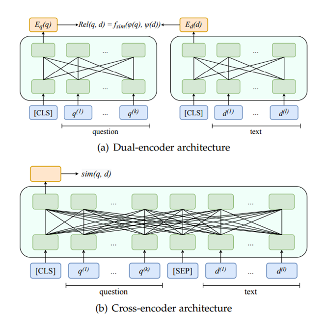

# es_matching
Matching algorithms for event sequences.

# Algorithm description

This algorithm uses a two-stage approach: Retriever + Reranker, for efficient and accurate information retrieval.

## Stage 1: Retriever

The Retriever stage focuses on quickly finding the nearest neighbors based on embeddings. It employs a late fusion technique using a dual-encoder architecture.

*   **Technique:** Late Fusion
*   **Architecture:** Dual-encoder
*   **Similarity Function:** `f_sim(q, d) = <emb_q, emb_d>` where `emb_q` and `emb_d` are embeddings of the query (q) and document (d) respectively, and `<>` denotes the dot product.

## Stage 2: Reranker

The Reranker stage refines the results from the Retriever by performing a more thorough, but computationally intensive, search over the candidate documents. It utilizes middle and late fusion techniques.

*   **Techniques:** Middle Fusion, Early Fusion
*   **Architecture:** Dual-encoder
*   **Similarity Function (Middle Fusion):** `f_sim(q, d) = MLP(emb_q, emb_d)` where `MLP` is a multi-layer perceptron that takes the query and document embeddings as input.

## Fusion Types

*   **Late Fusion:**  Combines the results of independent encoding processes.
*   **Middle Fusion:**  Combines the query and document embeddings before the final similarity calculation.
*   **Early Fusion:** (End-to-end training with Cross-encoder) Events in the query (q) and document (d) are ordered chronologically.

## Datasets

This project utilizes several datasets for training and evaluation:

*   **MBD:** The MBD dataset is described in detail in the paper available at [arXiv:2409.17587v1](https://arxiv.org/html/2409.17587v1).

*   **Data Fusion:** The MBD and Data Fusion datasets are preprocessed and available in the [Dzhambo/MBD](https://github.com/Dzhambo/MBD) repository.  Refer to the repository for instructions on accessing the data.

*   **CIKM2016:** This dataset was introduced in the CIKM Cup 2016 competition.

    *   Competition Link: [CIKM Cup 2016](https://competitions.codalab.org/competitions/11171)
    *   Data Download: The data files can be downloaded from this [Google Drive folder](https://drive.google.com/drive/folders/0B7XZSACQf0KdNXVIUXEyVGlBZnc).
    *   Data Conversion: Notebook cikm_data_process.ipynb is used to convert the dataset into the ptls format.

# Results
# cikm2016 dataset
## Retriever + reranker performance

* Top-30 candidates are retrieved by retriever and then classified by reranker
* The target is classification of positive pairs

| Algorithm                                         | F1 Score | Precision | Recall |
|---------------------------------------------------|----------|-----------|--------|
| Late fusion, RNN                                  | 0.39     | 0.39      | 0.39   |
| Middle fusion, RNN                                | 0.44     | 0.52      | 0.37   |
| Middle fusion, best from articles (TGCE)           | 0.46     | 0.49      | 0.44   |
| Middle fusion, transformers                       | 0.47     | 0.57      | 0.4    |
| Early fusion, best from articles                  | 0.51     | 0.57      | 0.58   |
| Early fusion + blending, modality token concat, transformers | 0.545    | 0.7       | 0.44   |

## Retriever Augmentation Ablation Results (Recall@100)

| Configuration         | Recall@100 |
| :-------------------- | :--------- |
| No Augmentation       | 0.71       |
| Coles Augmentation     | 0.74       |

## Reranker Ablation Study
* Top-100 candidates are retrieved by retriever, positive pairs are added, they are samples in 1:4 ratio, and this set is then classified by reranker
* The same retriever is used for all experiments
* The target is classification of positive pairs

| Model                                                                 | F1    | ROC-AUC |
| :-------------------------------------------------------------------- | :---- | :------ |
| Middle Fusion, RNN                                                    | 0.63  | 0.84    |
| Middle Fusion, RNN + time feat                                       | 0.67  | 0.86    |
| Mid. Fusion, XTransformers + time                                     | 0.70  | 0.89    |
| Mid. Fusion, XTransformers                                            | 0.68  | 0.88    |
| Vanilla Cross Encoder                                   | 0.68  | 0.88    |
| Early fusion, blend, add mod. token                                 | 0.724 | 0.91    |
| Early fusion, blend, concat mod. token                               | 0.74  | 0.926   |
| Early fusion, blend, concat mod. Token, time                        | 0.766 | 0.938   |

# MBD dataset

## Retriever, different variant 

*   **Batch Size:** Train/Valid: 128
*   **Head:** Input Size 128, 2x128 hidden layers, Regression.
*   **Loss:** Matching Softmax Loss.
*   **Optimizer:** AdamW, LR 0.0001, Weight Decay 1e-5.
*   **LR Scheduler:** StepLR, Step Size 1, Gamma 0.95.
*   **Warmup Steps:** 2000.
*   **Epochs:** 15

| Configuration                                                        | geo2trx (Recall@100) | trx2geo (Recall@100) |
| :------------------------------------------------------------------- | :------------------ | :------------------ |
| COLES Augmentation                                                  | 0.307343            | 0.311181            |
| No Augmentation                                                     | 0.307786            | 0.313838            |
| No Augmentation, Batch Size 256                                     | 0.303653            | 0.309410            |
| COLES Augmentation, Loss Only for Matching Different Modalities | 0.324945            | 0.325092            |

## Reranker Model Performance

* Top-100 candidates are retrieved by retriever, positive pairs are added, they are samples in 1:4 ratio, and this set is then classified by reranker
* The target is classification of positive pairs

## Training parameters
*   **Batch Size:** Train 1024
*   **Loss:** BCEWithLogitsLoss
*   **Optimizer:** AdamW, LR 1e-4, Weight Decay 1e-5
*   **LR Scheduler:** StepLR, Step Size 1, Gamma 0.95
*   **Warmup Steps:** 200

| Model                                                                 | ROC AUC | F1    |
| :-------------------------------------------------------------------- | :------ | :---- |
| Vanilla Cross Encoder                                                 | 0.712   | 0.665 |
| Early Fusion + Blending                                               | 0.716   | 0.668 |
| Early Fusion + Blending + Dynamic Time Bias                          | 0.718   | 0.668 |
| Early Fusion + Blending + Dynamic (Time + Modalities) Bias | 0.717   | 0.670 |

# data fusion dataset:
## Retriever, different variant 

*   **Batch Size:** Train: 256
*   **Head:** Input Size 128, 2x128 hidden layers.
*   **Loss:** Matching Softmax Loss
*   **Optimizer:** AdamW, LR 1e-4, Weight Decay 1e-5.
*   **LR Scheduler:** StepLR, Step Size 1, Gamma 0.95
*   **Warmup Steps:** 200

| Configuration                                                          | click2trx (Recall top 100) | trx2click (Recall top 100) |
| :--------------------------------------------------------------------- | :-------------- | :-------------- |
| COLES Augmentation                                                    | 0.093707        | 0.097856        |
| No Augmentation                                                       | 0.107538        | 0.110304        |
| COLES Augmentation, Loss on Different Modalities Only                  | 0.137621        | 0.136238        |

## Reranker Model Performance

* Top-100 candidates are retrieved by retriever, positive pairs are added, they are samples in 1:4 ratio, and this set is then classified by reranker
* The target is classification of positive pairs

## Training parameters
*   **Batch Size:** Train 64
*   **Loss:** BCEWithLogitsLoss
*   **Optimizer:** AdamW, LR 1e-4, Weight Decay 1e-6
*   **LR Scheduler:** StepLR, Step Size 1, Gamma 0.95
*   **Warmup Steps:** 200

| Model                                                                    | ROC AUC | F1    |
| :----------------------------------------------------------------------- | :------ | :---- |
| Early Fusion + Blending, Dyn Time Bias, Learnable Time Embd             | 0.674   | 0.459 |
| Early Fusion + Blending, Dyn Time Bias, Same Date                        | 0.689   | 0.468 |
| Early Fusion + Blending, Rotary Embd                                    | 0.660   | 0.443 |
| Early Fusion + Blending, Pos Sinus Embd                                 | 0.691   | 0.471 |
| Early Fusion + Blending                                                  | 0.656   | 0.444 |
| Early Fusion + Blending, Time2Vec + Dynamic Bias                         | 0.688   | 0.468 |
| Early Fusion + Blending, Time2Vec, Diff Embd                            | 0.692   | 0.475 |
| Early Fusion + Blending, Time2Vec                                        | 0.710   | 0.485 |
| Vanilla Cross-Encoder, Rotary Embd                                      | 0.679   | 0.462 |
| Vanilla Cross-Encoder, Pos Sinus Embd                                   | 0.692   | 0.476 |
| Vanilla Cross-Encoder, Time2Vec                                          | 0.709   | 0.485 |
| Vanilla Cross-Encoder, Time2Vec + Dynamic Bias                          | 0.701   | 0.484 |
| Vanilla Cross-Encoder, Time2Vec, Diff Embd                              | 0.706   | 0.485 |
| Vanilla Cross-Encoder, Dynamical Bias                                    | 0.688   | 0.467 |
| Vanilla Cross-Encoder, Dynamical Bias, Learnable Time Embd              | 0.681   | 0.458 |

## Internal dataset. Scaling for Large Datasets (Test Size: 10^6)
* Modalities: clickstream, transaction

| Stage                                            | F1     |
| :----------------------------------------------- | :----- |
| Late Fusion                                      | 0.0082 |
| Middle Fusion                                    | 0.0087 |
| Tuned Top Retrieval                            | 0.0096 |

# Launching training and checking
## bash files for running training 
* bash files with launching runs are .sh files in the root repo.
* files with prefix train_data_fusion are for training on data fusion dataset
* files with prefix train_MBD are for training on MBD dataset
* other bash files are for training on cikm2016 datasets

## Convertation to crossencoder training format
For crossencoder training we need to construct dataset out of late fusion dataset.

Top-n candidates are retrieved by a trained retriever, positive pairs are added, then positive and negative (wrong) pairs are samples in 1:4 ratio.

Bash files for launching crossencoder training dataset construction are bash files with "convert_to_crossencoder" prefix. 

Parameters:
*   `--parquet_in`: Input dataset, in a format of parquet data file or folder (multiple allowed).
*   `--yaml_in`: YAML config file which was used for training retriever.
*   `--checkpoint`: Retriever model checkpoint file.
*   `--parquet_out`: Output Parquet file with crossencoder training dataset.
*   `--col_id`: user ID column name (default: "epk_id").
*   `--topn`: Number of top samples retrieved by retriever (default: 30).
*   `--mod1_cols`: Additional columns for modality 1 (multiple allowed) - columns which don't have the modality1 prefix.
*   `--mod2_cols`: Additional columns for modality 2 (multiple allowed) - columns which don't have the modality12 prefix.
*   `--mod1_name`: modality 1 prefix. Columns of this modality should have this prefix, if not specified in mod1_cols.
*   `--mod2_name`: modality 2 prefix. Columns of this modality should have this prefix, if not specified in mod2_cols.

## Retriever/Reranker Quality Check Module
m3_dataset_dists.py - this module checks the quality of a retriever and reranker system. Launch it from command line with arguments. 

It can check only retriever or retriever+reranker. The measuring task is quality of classification of matched\non-matched pairs. The metrics are f1, recall, precision, roc auc.

### Arguments

*   `--parquet_in`: Test dataset, input parquet data file or folder (multiple allowed).
*   `--yaml_embs`: YAML config for the embeddings model.
*   `--checkpoint_embs`: Checkpoint file for the embeddings model.
*   `--folder_out`: Output folder for results.
*   `--yaml_reranker`: YAML config for the reranker model (if using reranker).
*   `--checkpoint_reranker`: Checkpoint file for the reranker model (if using reranker).
*   `--col_id`: ID column name (default: "epk_id").
*   `--chunk_size`: Chunk size for metric calculation (if applicable).
*   `--samples_num`: Number of samples for metric calculation (if applicable).
*   `--write_matched`: Flag to write matched pairs.
*   `--no_quality`: Flag to skip quality metric calculation.

